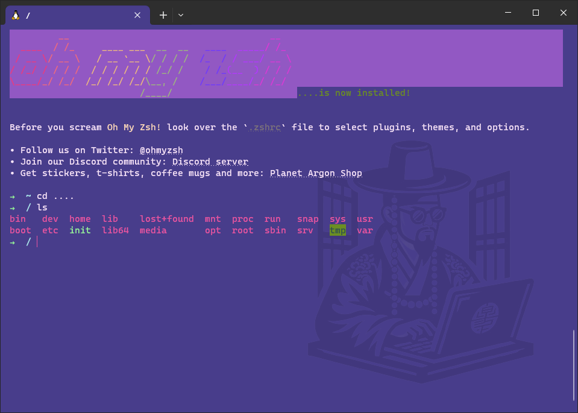

# Cyberpunk Seoul - Windows Terminal Theme

## Introduction

'**Cyberpunk Seoul**' is a theme for Windows Terminal that combines cyberpunk aesthetics with the unique ambiance of Seoul.

## Installation

To install the 'Cyberpunk Seoul' theme in your Windows Terminal:

1. Open your Windows Terminal settings JSON file. 

```text
%LOCALAPPDATA%\Packages\Microsoft.WindowsTerminal_8wekyb3d8bbwe\LocalState
```

2. Add the color scheme details from `profile/cyberpunk-seoul.json` to the `schemes` section of your JSON file (`settings.json`).
3. Set `Cyberpunk Seoul` as the color scheme for your desired profile.

Example of adding the theme to your settings:

```json
"schemes": [
    // ... other color schemes ...
    {
        "name": "Cyberpunk Seoul",
        // ... color scheme details ...
    }
],
"profiles": {
    "list": [
        {
            // ... profile details ...
            "colorScheme": "Cyberpunk Seoul",
            "padding":"15, 8, 8, 8",
        }
    ]
}
```

4. (Optional for the Background Image) Download the `profile\background.png` image provided in this repository and place it in LocalState where the settings JSON file is located.
Add or modify the following properties within the profile settings:

```json
"profiles": {
    "list": [
        {
            // ... profile details ...
            "colorScheme": "Cyberpunk Seoul",
            "padding":"15, 8, 8, 8",
            "backgroundImage": "ms-appdata:///Local/background.png",
            "backgroundImageAlignment": "bottomRight",
            "backgroundImageOpacity": 0.1,
            "backgroundImageStretchMode": "none"
        }
    ]
}
```

## License
This theme is distributed under the GNU General Public License v3.0 (GPL-3.0). See `LICENSE` for more information.
